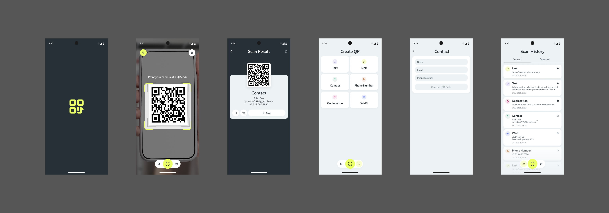
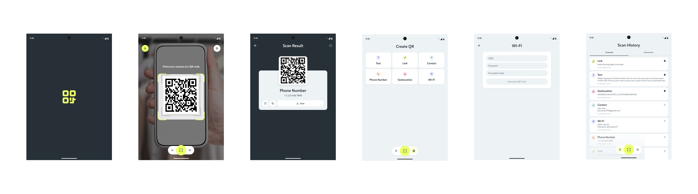

# 📱 QR Craft

QR Craft is a modern Android application designed for **scanning, generating, and managing QR codes** with a smooth, camera-first experience.  
It provides a rich set of utilities including real-time QR scanning, code generation, history management, favorites, and image saving — all wrapped in a clean and adaptive UI.

---

## 🚀 Features

### 🔍 QR Code Scanning
- Live camera preview with real-time QR detection.
- Supports multiple QR types:
    - Text
    - Links (with clickable highlighting)
    - Contact (vCard)
    - Phone Number
    - Geolocation
    - Wi-Fi credentials
- Flashlight toggle for low-light scanning.
- Scan QR codes directly from device images.
- Loading indicators and error handling for smooth UX.

### 📝 Scan Results
- Displays detected QR code with content type and details.
- Editable titles (up to 32 characters).
- Actions:
    - **Share** via system share sheet.
    - **Copy** content to clipboard.
    - **Save** QR code as PNG to device Downloads.
    - **Favorite** QR codes for quick access.

### ➕ QR Code Generation
- Create custom QR codes with different types:
    - Text
    - Link
    - Contact
    - Phone Number
    - Geolocation
    - Wi-Fi
- Preview before saving or sharing.
- Actions:
    - Share generated codes.
    - Copy content.
    - Save QR code image.

### 📂 History Management
- Unified history for both **Scanned** and **Generated** codes.
- Separate tabs for easy navigation.
- Editable titles and content preview.
- Sorts favorites on top, followed by recent items.
- Long-press actions:
    - Share
    - Delete
- Preview screen for quick re-use.

### ⭐ Favorites
- Mark scanned or generated codes as favorites.
- Favorites are always displayed on top of history lists.
- Favorites sync seamlessly across screens.

---

## 📱 Adaptive Layouts
- Fully responsive design:
    - Optimized for **mobile devices** (up to 600dp).
    - Optimized for **wider screens / tablets** (600dp and above).
- Consistent fixed-width content blocks for better readability.

---

## 📸 Screenshots

### Mobile View

### Tablet View

---

## 🛠️ Tech Stack
- **Language:** Kotlin
- **Frameworks & Libraries:**
    - Jetpack Compose / Android View System (UI)
    - CameraX (QR scanning)
    - Google ML Kit / ZXing (QR detection & generation)
    - MediaStore API (for saving QR codes in device)
    - Koin (Dependency Injection)
    - Timber (Logging)
    - Room (Local database)
- **Architecture:** MVVM + Clean modular structure
- **Coroutines & Flow** for async and reactive updates
---

## 🏗 Project Architecture
QR Craft follows a **Clean Architecture + MVVM hybrid** pattern.  
👉 See the full [Project Structure Documentation](docs/project-structure.md) for details.

---

## 📌 Requirements

- Minimum SDK: 21 (Lollipop)
- Target SDK: Latest stable
- Permissions:
- Camera (for scanning QR codes)
- Storage (optional, handled via MediaStore API for saving)

---

## 🧑‍💻 Contributing

Contributions are welcome! Please open an issue or submit a pull request for new features, improvements, or bug fixes.

---

## 📄 License

This project is licensed under the [MIT License](https://opensource.org/licenses/MIT).

---

## ✨ Acknowledgements

- [Google ML Kit](https://developers.google.com/ml-kit/vision/barcode-scanning)
- [ZXing](https://github.com/zxing/zxing)
- [CameraX](https://developer.android.com/training/camerax)
- [Timber](https://github.com/JakeWharton/timber)
- [Room DB](https://developer.android.com/jetpack/androidx/releases/room)
- [Koin](https://github.com/InsertKoinIO/koin)
